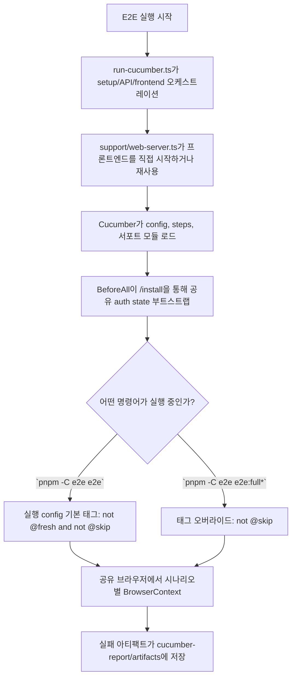

# E2E

이 패키지는 Dify의 저장소 수준 엔드투엔드 테스트를 포함합니다.

이 파일은 `e2e/`의 공식 패키지 가이드입니다. 상세한 워크플로우, 아키텍처, 디버깅 및 보고 문서를 여기에 유지합니다. `README.md`는 이 파일을 가리키는 최소한의 포인터로 유지하여 두 문서가 어긋나지 않도록 합니다.

스위트는 시나리오 정의에 Cucumber를, 브라우저 실행 계층에 Playwright를 사용합니다.

다음을 테스트합니다:

- 소스에서 시작된 백엔드 API
- 프로덕션 아티팩트에서 서비스되는 프론트엔드
- Docker에서 시작된 미들웨어 서비스

## 사전 요구 사항

- Node.js `^22.22.1`
- `pnpm`
- `uv`
- Docker

저장소 루트에서 다음 명령어를 실행합니다.

Playwright 브라우저를 최초 1회 설치합니다:

```bash
pnpm install
pnpm -C e2e e2e:install
pnpm -C e2e check
```

`pnpm install`은 저장소 워크스페이스를 통해 해석되며 공유 루트 락파일과 `pnpm-workspace.yaml`을 사용합니다.

`pnpm -C e2e check`를 E2E TypeScript, Cucumber 서포트 코드 또는 feature 글루 편집 후 기본 로컬 검증 단계로 사용합니다. 이 패키지의 포맷팅, 린트, 타입 체크를 실행합니다.

일반 명령어:

```bash
# 인증 전용 회귀 테스트 (기본적으로 @fresh 제외)
# 백엔드 API, 프론트엔드 아티팩트, 미들웨어 스택이 이미 실행 중이어야 함
pnpm -C e2e e2e

# 전체 리셋 + 신규 설치 + 인증 시나리오
# 필요한 미들웨어/의존성을 자동으로 시작
pnpm -C e2e e2e:full

# 태그된 하위 집합 실행
pnpm -C e2e e2e -- --tags @smoke

# 헤드리드 브라우저
pnpm -C e2e e2e:headed -- --tags @smoke

# 로컬 디버깅을 위해 브라우저 동작 늦추기
E2E_SLOW_MO=500 pnpm -C e2e e2e:headed -- --tags @smoke
```

프론트엔드 아티팩트 동작:

- `web/.next/BUILD_ID`가 있으면 E2E는 기본적으로 기존 빌드를 재사용합니다
- `E2E_FORCE_WEB_BUILD=1`을 설정하면 E2E가 시작 전 프론트엔드를 다시 빌드합니다

## 수명 주기



소유권은 다음과 같이 분할됩니다:

- `scripts/setup.ts`는 리셋, 미들웨어, 백엔드, 프론트엔드 시작을 위한 단일 환경 진입점입니다
- `run-cucumber.ts`는 E2E 실행과 Cucumber 호출을 오케스트레이션합니다
- `support/web-server.ts`는 프론트엔드 재사용, 시작, 준비, 종료를 관리합니다
- `features/support/hooks.ts`는 auth 부트스트랩, 시나리오 수명 주기, 진단을 관리합니다
- `features/support/world.ts`는 시나리오별 타입이 지정된 컨텍스트를 소유합니다
- `features/step-definitions/`은 공식 VS Code Cucumber 플러그인이 `e2e/`를 워크스페이스 루트로 열 때 기본 컨벤션으로 작동하도록 도메인 지향 글루를 보유합니다

패키지 레이아웃:

- `features/`: 기능별로 그룹화된 Gherkin 시나리오
- `features/step-definitions/`: 도메인 지향 스텝 정의
- `features/support/hooks.ts`: 스위트 수명 주기, auth-state 부트스트랩, 진단
- `features/support/world.ts`: 공유 시나리오 컨텍스트
- `support/web-server.ts`: 타입이 지정된 프론트엔드 시작/재사용 로직
- `scripts/setup.ts`: 리셋 및 서비스 수명 주기 명령어
- `scripts/run-cucumber.ts`: Cucumber 오케스트레이션 진입점

동작은 인스턴스 상태에 따라 다릅니다:

- 초기화되지 않은 인스턴스: 설치를 완료하고 인증 상태를 저장
- 초기화된 인스턴스: 로그인하고 인증 상태를 재사용

따라서 `@fresh` 설치 시나리오는 `pnpm -C e2e e2e:full*` 흐름에서만 실행됩니다. 기본 `pnpm -C e2e e2e*` 흐름은 Cucumber config 태그를 통해 `@fresh`를 제외하여 이미 초기화된 인스턴스에 대해 재실행할 수 있습니다.

모든 지속된 E2E 상태 리셋:

```bash
pnpm -C e2e e2e:reset
```

다음을 제거합니다:

- `docker/volumes/db/data`
- `docker/volumes/redis/data`
- `docker/volumes/weaviate`
- `docker/volumes/plugin_daemon`
- `e2e/.auth`
- `e2e/.logs`
- `e2e/cucumber-report`

전체 미들웨어 스택 시작:

```bash
pnpm -C e2e e2e:middleware:up
```

전체 미들웨어 스택 중지:

```bash
pnpm -C e2e e2e:middleware:down
```

미들웨어 스택 포함:

- PostgreSQL
- Redis
- Weaviate
- Sandbox
- SSRF proxy
- Plugin daemon

신규 설치 검증:

```bash
pnpm -C e2e e2e:full
```

이미 실행 중인 미들웨어 스택에 대해 Cucumber 스위트 실행:

```bash
pnpm -C e2e e2e:middleware:up
pnpm -C e2e e2e
pnpm -C e2e e2e:middleware:down
```

아티팩트 및 진단:

- `cucumber-report/report.html`: HTML 보고서
- `cucumber-report/report.json`: JSON 보고서
- `cucumber-report/artifacts/`: 실패 스크린샷 및 HTML 캡처
- `.logs/cucumber-api.log`: 백엔드 시작 로그
- `.logs/cucumber-web.log`: 프론트엔드 시작 로그

HTML 보고서를 로컬에서 열기:

```bash
open cucumber-report/report.html
```

## 새로운 시나리오 작성

### 워크플로우

1. `features/<capability>/` 아래에 `.feature` 파일 생성
1. `features/step-definitions/<capability>/` 아래에 스텝 정의 추가
1. 새로운 것을 작성하기 전에 `common/`과 다른 정의 파일의 기존 스텝을 먼저 재사용
1. `pnpm -C e2e e2e -- --tags @your-tag`로 검증
1. 커밋 전에 `pnpm -C e2e check` 실행

### Feature 파일 컨벤션

모든 feature나 시나리오에 기능 태그를 추가합니다. 의도를 명확히 하거나 브라우저 세션 동작을 변경할 때만 auth 태그를 추가합니다:

```gherkin
@datasets @authenticated
Feature: Create dataset
  Scenario: Create a new empty dataset
    Given I am signed in as the default E2E admin
    When I open the datasets page
    ...
```

- 기능 태그(`@apps`, `@auth`, `@datasets`, …)는 관련 시나리오를 선택적 실행을 위해 그룹화합니다
- Auth/세션 태그:
  - 기본 동작 — 시나리오는 다르게 표시되지 않는 한 공유 인증된 storageState로 실행됩니다
  - `@unauthenticated` — 쿠키나 스토리지가 없는 깨끗한 BrowserContext 사용
  - `@authenticated` — 가독성이나 선택적 실행을 위한 선택적 의도 태그. 현재 훅 동작을 자체적으로 변경하지 않습니다
  - `@fresh` — `e2e:full` 모드에서만 실행(초기화되지 않은 인스턴스 필요)
  - `@skip` — 모든 실행에서 제외

시나리오는 짧고 선언적으로 유지합니다. 각 스텝은 UI가 _어떻게_ 작동하는지가 아닌 사용자가 _무엇을_ 하는지를 설명해야 합니다.

### 스텝 정의 컨벤션

```typescript
import type { DifyWorld } from '../../support/world'
import { Then, When } from '@cucumber/cucumber'
import { expect } from '@playwright/test'

When('I open the datasets page', async function (this: DifyWorld) {
  await this.getPage().goto('/datasets')
})
```

규칙:

- 항상 `this`를 `DifyWorld`로 타이핑하여 적절한 컨텍스트 접근
- `async function` 사용(화살표 함수 금지 — Cucumber가 `this`를 바인딩)
- 하나의 스텝 = 하나의 사용자 관찰 가능한 액션 또는 하나의 단언
- 시나리오 간에 스텝을 무상태로 유지합니다. 시나리오 내 상태에는 `DifyWorld` 속성을 사용합니다

### 로케이터 우선순위

Playwright 권장 로케이터 전략을 우선순위대로 따릅니다:

| 우선순위 | 로케이터           | 예시                                      | 사용 시기                            |
| -------- | ------------------ | ----------------------------------------- | ------------------------------------ |
| 1        | `getByRole`        | `getByRole('button', { name: 'Create' })` | 기본 선택 — 접근성과 복원력          |
| 2        | `getByLabel`       | `getByLabel('App name')`                  | 보이는 라벨이 있는 폼 입력           |
| 3        | `getByPlaceholder` | `getByPlaceholder('Enter name')`          | 보이는 라벨 없는 입력                |
| 4        | `getByText`        | `getByText('Welcome')`                    | 정적 텍스트 콘텐츠                   |
| 5        | `getByTestId`      | `getByTestId('workflow-canvas')`          | 시맨틱 로케이터가 작동하지 않을 때만 |

raw CSS/XPath 셀렉터는 피합니다. DOM 구조가 변경될 때 깨집니다.

### 단언

`@playwright/test`의 `expect`를 사용합니다 — 조건이 충족되거나 타임아웃이 만료될 때까지 자동 대기하고 재시도합니다:

```typescript
// URL 단언
await expect(page).toHaveURL(/\/datasets\/[a-f0-9-]+\/documents/)

// 요소 가시성
await expect(page.getByRole('button', { name: 'Save' })).toBeVisible()

// 요소 상태
await expect(page.getByRole('button', { name: 'Submit' })).toBeEnabled()

// 부정
await expect(page.getByText('Loading')).not.toBeVisible()
```

수동 `waitForTimeout`이나 폴링 루프를 사용하지 마세요. 특정 단언에 더 긴 대기가 필요하면 단언에 `{ timeout: 30_000 }`를 전달합니다.

### Cucumber 표현식

Cucumber 표현식 파라미터 타입을 사용하여 Gherkin 스텝에서 값을 추출합니다:

| 타입       | 패턴          | 예시 스텝                          |
| ---------- | ------------- | ---------------------------------- |
| `{string}` | 따옴표 문자열 | `I select the "Workflow" app type` |
| `{int}`    | 정수          | `I should see {int} items`         |
| `{float}`  | 소수          | `the progress is {float} percent`  |
| `{word}`   | 단일 단어     | `I click the {word} tab`           |

UI 라벨, 이름, 텍스트 콘텐츠에는 `{string}`을 선호합니다 — Gherkin의 따옴표 값에 자연스럽게 매핑됩니다.

### 로케이터 범위 지정

페이지에 유사한 요소가 여러 개 있을 때 로케이터를 컨테이너로 범위 지정합니다:

```typescript
When('I fill in the app name in the dialog', async function (this: DifyWorld) {
  const dialog = this.getPage().getByRole('dialog')
  await dialog.getByPlaceholder('Give your app a name').fill('My App')
})
```

### 실패 진단

`After` 훅이 실패 시 자동으로 캡처합니다:

- 전체 페이지 스크린샷(PNG)
- 페이지 HTML 덤프
- 콘솔 에러 및 페이지 에러

아티팩트는 `cucumber-report/artifacts/`에 저장되고 HTML 보고서에 첨부됩니다. 스텝 정의에 추가 코드가 필요 없습니다.

## 기존 스텝 재사용

새 스텝 정의를 작성하기 전에 기존 스텝 정의 파일을 먼저 검사합니다. 문구와 동작이 이미 일치할 때 해당 스텝을 재사용하고, 시나리오에 진정으로 새로운 사용자 액션이나 단언이 필요할 때만 새 스텝을 추가합니다. `common/`의 스텝은 모든 기능에서 광범위한 재사용을 위해 설계되었습니다.

또는 스텝 정의 파일을 직접 탐색합니다:

- `features/step-definitions/common/` — 모든 기능에서 공유하는 auth 가드와 탐색 단언
- `features/step-definitions/<capability>/` — 단일 기능 영역에 범위가 지정된 도메인별 스텝
